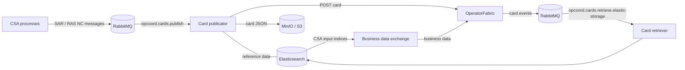

# Architecture

## Data flow

## Workers

Every worker has the same layout:

| File | Role |
|---|---|
| `worker.py` | Entry point. Sets up logging, then starts a RabbitMQ consumer (or runs once, for the scheduled job). |
| `handlers.py` | The business logic. The consumer calls the handler's `handle(message, properties)` for every message. |
| `settings.py` | Pydantic settings read from environment variables. See [Configuration](configuration.md). |

The two consumers use [`integrations.rmq.RMQConsumer`](reference/integrations.md).
It runs each message on a thread pool with a prefetch of 1, acknowledges
it when every handler succeeds, and **rejects it without requeueing** when a
handler raises. A failed message is therefore dropped (or dead-lettered, if
the queue is set up for it) and is not retried.

## Card life cycle

A card is built in two stages. Knowing which stage owns which field explains
most "why does the card look like this" questions.

**1. Publish time**, in the card publicator. The result is frozen into the card:

1. [`builders.py`](reference/card-publicator.md#card_publicator.builders) converts
   the NC RDF/XML to JSON with `rdf_converter.py` and applies the static
   fields for the profile from `card_publicator/cards.yaml` (process, state,
   severity, i18n keys, recipients).
2. [`enrichment.py`](reference/card-publicator.md#card_publicator.enrichment)
   adds reference data from Elasticsearch: area and party names, contingency
   and remedial action names and operators, and for RAS the linked loading
   violations.
3. [`handlers.py`](reference/card-publicator.md#card_publicator.handlers) sets the
   `cycle` and `period` parameters on `title` and `summary`, applies RAS routing,
   and posts the card.

**2. Render time**, in the OpFab UI, on every display:

- `title.key` and `summary.key` are looked up in the deployed bundle's
  `i18n.json`, and `{{name}}` tokens are filled from `parameters`.
- The bundle's Handlebars template renders the opened card from `card.data`.

!!! warning "Keep payload and bundle in sync"
    The i18n `key`, the parameter names, `process`, `state` and
    `processVersion` must match between `cards.yaml`/`handlers.py` and the
    deployed bundle. A mismatch does not fail publication; the card just
    renders with missing text or is not shown.

## Card profiles

| Profile | `process` / `state` | Recipients | Dates |
|---|---|---|---|
| SAR | `crosa` / `sar` | `groupRecipients: ["ADMIN"]` | `startDate` from the `scenario-time` header, `endDate` one hour later |
| RAS | `ra_coordination` / `proposed` | `entityRecipients`: the publisher and the TSO operating the remedial action. That TSO must respond. | `startDate`/`endDate` from the schedule's `FullModel` |

A RAS message must contain exactly one `RemedialActionSchedule`. The target TSO
is the `RemedialActionOperatorEIC` that enrichment resolves for it.
