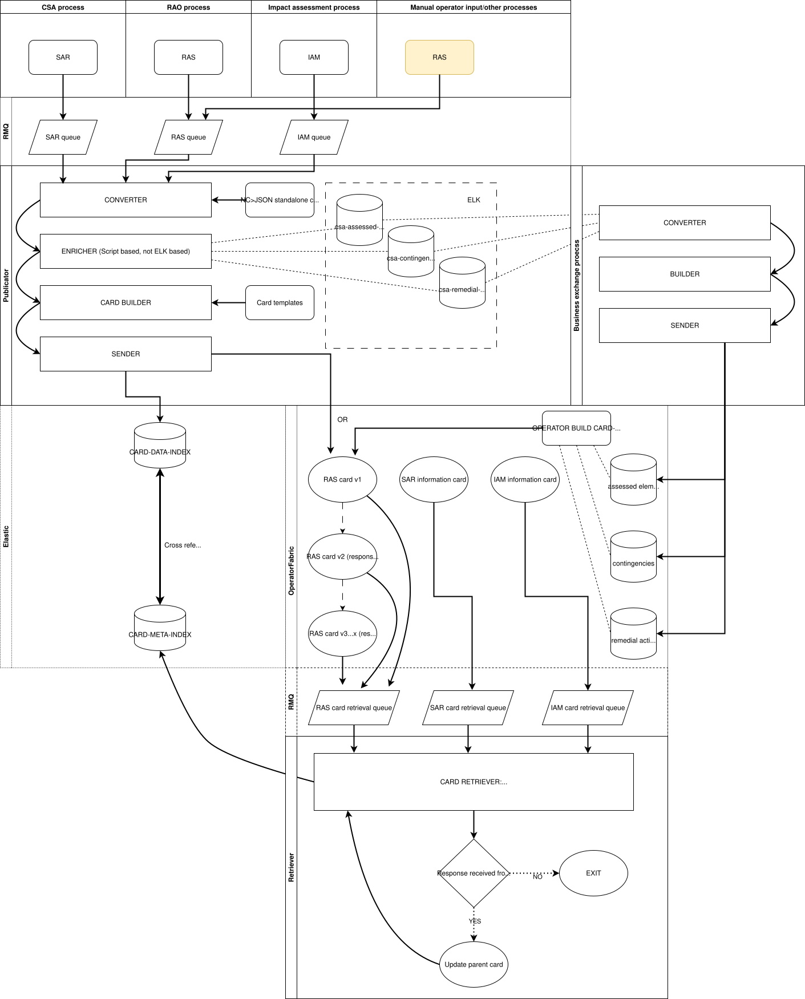

# opcoord-platform

Regional coordination tool for operational data, built on the open source
[OperatorFabric](https://opfab.github.io/) (OpFab) platform.

Upstream CSA processes publish Network Code (NC) messages to RabbitMQ: security
analysis results (SAR) and remedial action schedules (RAS). The workers in this
repository turn those messages into OpFab cards, route them to the RCC and the
relevant TSOs, archive what was published, and make CSA input data available
to OpFab card templates.

## Components

| Component | Runs as | Does |
|---|---|---|
| [Card publicator](workers/card-publicator.md) | Long-running RabbitMQ consumer | Converts SAR/RAS NC messages into OpFab cards, enriches them with reference data from Elasticsearch, and publishes them. |
| [Card retriever](workers/card-retriever.md) | Long-running RabbitMQ consumer | Stores cards that OpFab emits into an Elasticsearch index. |
| [Business data exchange](workers/business-data-exchange.md) | Daily scheduled job | Exports CSA input data (contingencies, assessed elements, remedial actions) from Elasticsearch to OpFab business data. |
| `integrations/` | Library | Clients for Elasticsearch, OpFab, RabbitMQ and MinIO (S3), shared by all workers. |
| `config/` | Library | Connection settings and logging setup, shared by all workers. |

## Where to start

- New to the codebase: read [Architecture](architecture.md).
- Running a worker locally: see [Development](development.md).
- Setting a worker up: see [Configuration](configuration.md).

The OpFab process bundles (templates, `i18n.json`, process states) that these
cards render with are **not** in this repository. They are maintained and
deployed separately.
